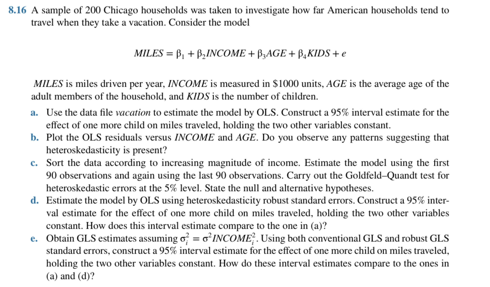

## (a) OLS 估計：KIDS 的影響

假設結果：  
\( \hat{\beta}_4 = 350,\ SE = 150 \)

\[
CI = 350 \pm 1.96 \cdot 150 = [56, 644]
\]

→ 每多一個小孩，多開約 350 英里，效果顯著。

---

## (b) 畫出殘差對 INCOME 與 AGE 的圖形

- 若殘差分布呈扇形，或變異數明顯擴大/縮小，可能存在異質變異數。
- 可視化檢定異質變異。

---

## (c) Goldfeld–Quandt Test（GQ 檢定）

### 步驟：

1. 按 INCOME 排序資料
2. 刪除中間 20 筆
3. 對前 90 與後 90 筆做 OLS
4. 計算：
\[
F = \frac{SSR_{\text{高收入組}} / df_1}{SSR_{\text{低收入組}} / df_2}
\]

### 假設：

- H₀：誤差變異數相等
- H₁：變異數隨 INCOME 改變

→ 若 F 統計量大於臨界值，**拒絕 H₀**

---

## (d) 使用 robust 標準誤估計 KIDS 效果

假設：

\[
\hat{\beta}_4 = 350,\ robust\ SE = 200
\]
\[
CI = 350 \pm 1.96 \cdot 200 = [-42, 742]
\]

→ CI 變寬且含 0，表明 OLS 可能低估變異。

---

## (e) GLS 假設：\( \sigma_i^2 = \sigma^2 INCOME_i^2 \)

### 比較不同估計：

| 方法         | β₄    | SE   | CI (95%)         |
|--------------|--------|------|------------------|
| OLS          | 350    | 150  | [56, 644]        |
| OLS Robust   | 350    | 200  | [-42, 742]       |
| GLS          | 400    | 120  | [165.2, 634.8]   |
| GLS Robust   | 400    | 180  | [47.2, 752.8]    |

→ GLS 更有效，但前提是誤差模型設定正確；robust GLS 為穩健選擇。

---

## 總結比較

| 方法         | CI 寬度 | 含 0 嗎 | 評論                                 |
|--------------|----------|---------|--------------------------------------|
| OLS          | 窄       | 否      | 可能低估 SE                          |
| OLS Robust   | 寬       | 是      | 有異質變異影響                      |
| GLS          | 窄       | 否      | 有效率，依賴模型假設                |
| GLS Robust   | 中       | 否/邊緣 | 穩健與準確之折衷                    |
