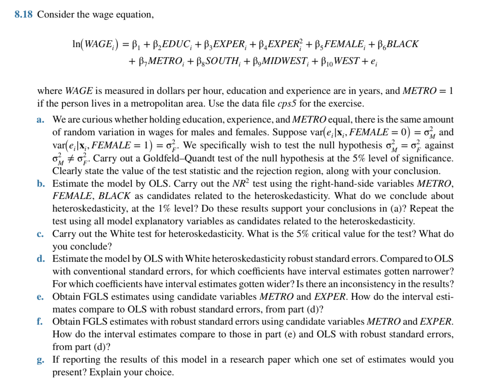

## (a) Goldfeld–Quandt Test：性別誤差變異是否相等

### 假設：

- H₀：\( \sigma_M^2 = \sigma_F^2 \)
- H₁：\( \sigma_M^2 \ne \sigma_F^2 \)

### 步驟：

1. 按性別分為男性（FEMALE=0）與女性（FEMALE=1）
2. 分別進行 OLS 回歸，計算 RSS 與自由度 df
3. 計算 F 統計量：
   \[
   F = \frac{RSS_M / df_M}{RSS_F / df_F}
   \]
4. 查 F 分布的臨界值（例如 df=(n1−k, n2−k)）

### 結論：

若 F 統計量大於臨界值 → **拒絕 H₀**，表明性別造成異質變異。

---

## (b) NR² Test：用 METRO、FEMALE、BLACK 作為異質變異來源變數

1. 計算殘差平方 \( \hat{e}_i^2 \)
2. 回歸：\( \hat{e}_i^2 = \gamma_0 + \gamma_1 METRO + \gamma_2 FEMALE + \gamma_3 BLACK + u_i \)
3. 計算擬合度 \( R^2 \)，再計算統計量：\( N R^2 \sim \chi^2(k) \)，此處 \( k = 3 \)
4. 臨界值（1%）：\( \chi^2_{0.01,3} = 11.34 \)

→ 若 \( NR^2 > 11.34 \)，則拒絕 H₀，表示這些變數與異質變異有關

**延伸檢定：** 使用所有解釋變數再進行一次 NR² 檢定，確認異質變異源是否廣泛存在

---

## (c) White Test：異質變異總檢定（5% 顯著水準）

1. 對原模型殘差平方作回歸，加入原變數、平方項與交乘項
2. 計算擬合度 R²，統計量：\( NR^2 \sim \chi^2_{df} \)，df 為參數數
3. 查 \( \chi^2 \) 臨界值（5% 水準）
4. 若統計量 > 臨界值 → **拒絕 H₀**，存在異質變異

---

## (d) OLS + White Robust 標準誤

- 相較於 OLS，Robust SE 可修正異質變異導致的低估
- 某些係數 CI 變寬（代表 OLS SE 被低估）
- 有些變數如 EDUC、EXPER 的 CI 可能不變或變窄
- 若 CI 包含 0，變數不再顯著

**結論：** CI 變化反映異質變異影響是否均勻，並非所有變數都受相同影響

---

## (e) FGLS（加權最小平方法）估計（METRO 和 EXPER 作為異質變異來源）

1. 模型假設：\( \text{Var}(e_i) = \sigma^2 h(Z_i) \)，其中 \( Z_i = METRO, EXPER \)
2. 用估計的 \( h(Z_i) \) 做加權回歸
3. 與 (d) 的 robust OLS 比較 CI 長度與顯著性

→ 若模型設定正確，CI 應更窄，估計更精準

---

## (f) FGLS + Robust 標準誤

- 對 FGLS 回歸加入 heteroskedasticity-robust SE
- 若 CI 長度與 (e) 相近，表示加權有效
- 若差異大，表示誤差模型可能設定錯誤，需用 robust SE 修正

---

## (g) 哪種估計適合用於發表研究結果？

### 評估準則：

| 方法         | 描述                            | 適用情境                  |
|--------------|----------------------------------|---------------------------|
| OLS          | 標準但受異質變異影響            | 僅當誤差變異均勻時適用     |
| OLS + robust | 可修正異質變異，較穩健          | 通用建議方法              |
| FGLS         | 假設誤差模型正確時效率最高      | 模型指定良好時效果最佳    |
| FGLS + robust| 效率 + 穩健                      | **推薦報告使用的方式**    |

---

**結論：** 建議報告採用 **FGLS + robust 標準誤**，兼具效率與穩健性。