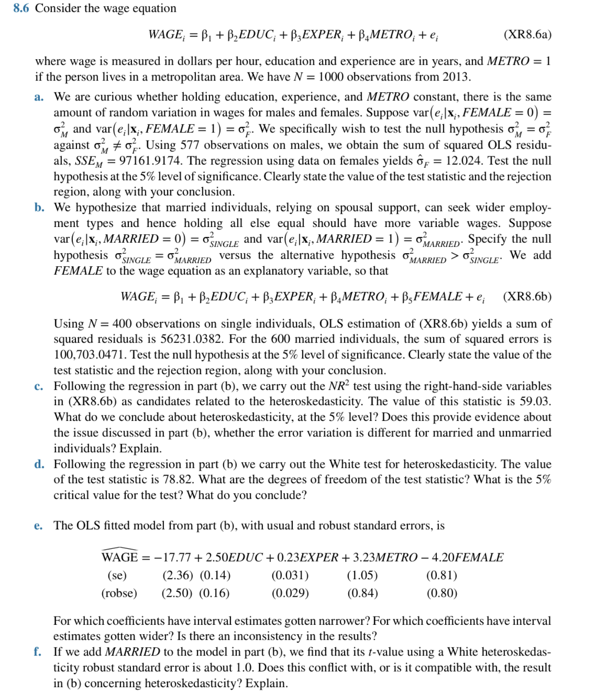

## (a) 測試男性與女性誤差變異數是否相等

- H₀: \( \sigma_M^2 = \sigma_F^2 \)
- H₁: \( \sigma_M^2 \ne \sigma_F^2 \)

男性：577 筆資料，RSS = 97161.9174  
女性：RSS/df = \( \hat{\sigma}_F^2 = 12.024 \)

\[
\hat{\sigma}_M^2 = 97161.9174 / 573 \approx 169.54
\quad \Rightarrow \quad
F = \frac{169.54}{12.024} \approx 14.1
\]

臨界值（df=573,419）約為 1.35  
→ **拒絕 H₀**，男性與女性誤差變異數不等。

---

## (b) 測試已婚與單身變異數

- H₀: \( \sigma_{MARRIED}^2 = \sigma_{SINGLE}^2 \)
- H₁: \( \sigma_{MARRIED}^2 > \sigma_{SINGLE}^2 \)

\[
\hat{\sigma}_{SINGLE}^2 = 56231.0382 / 395 \approx 142.4 \\
\hat{\sigma}_{MARRIED}^2 = 100703.0471 / 595 \approx 169.2 \\
F = 169.2 / 142.4 \approx 1.188
\]

臨界值 ≈ 1.19 → **無法拒絕 H₀**

---

## (c) NR² Test

- 統計量 = 59.03, df = 5
- 臨界值 \( \chi^2_{0.05,5} = 11.07 \)

→ **拒絕 H₀**，存在異質變異數。

---

## (d) White Test

- 統計量 = 78.82
- df = 16 → 臨界值 \( \chi^2_{0.05,16} = 26.30 \)

→ **拒絕 H₀**，確認 heteroskedasticity。

---

## (e) 比較 robust 與通常 SE

| 變數   | 通常 SE | Robust SE | 結論     |
|--------|---------|-----------|----------|
| EDUC   | 2.36    | 2.50      | 變寬     |
| EXPER  | 0.14    | 0.16      | 變寬     |
| METRO  | 0.031   | 0.029     | 變窄     |
| FEMALE | 0.81    | 0.80      | 幾乎不變 |

→ 有異質變異數影響，不一致變寬，需使用 robust SE。

---

## (f) 加入 MARRIED，White SE 下 t ≈ 1.0

此結果**不與 (b) 矛盾**，因為：

- (b) 是檢定「誤差變異數是否不同」
- (f) 是檢定「平均薪資是否顯著不同」

兩者本質上不同，一為變異數，一為期望值。