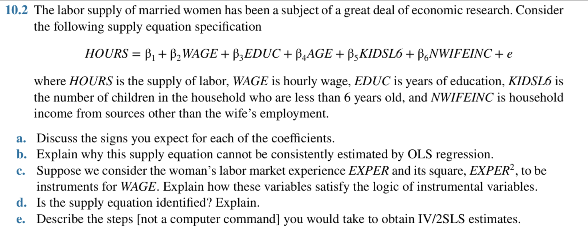

## (a) 預期係數符號

| 變數      | 預期符號 | 解釋                                                                 |
|-----------|-----------|----------------------------------------------------------------------|
| WAGE      | +         | 工資提高 → 替代效果促進工作                                        |
| EDUC      | +         | 教育程度高 → 勞動參與傾向強                                        |
| AGE       | 不確定    | 可能呈現非線性關係（年輕與年長影響不同）                           |
| KIDSL6    | −         | 幼兒需要照顧 → 抑制女性勞動供給                                   |
| NWIFEINC  | −         | 家中已有其他收入 → 勞動意願下降                                   |

---

## (b) 為何 OLS 無法一致估計此模型？

- 主要問題：\( WAGE \) 是**內生變數**
- 其與誤差項 \( e \) 可能同時受到 unobserved ability 等因素影響
- 導致 OLS 估計的 \( \beta_2 \) **有偏且不一致**

---

## (c) 使用 EXPER 與 EXPER² 作為 WAGE 的工具變數是否合理？

### 工具變數條件：

1. **相關性（Relevance）**：\( EXPER \) 與工資有強關聯  
2. **外生性（Exogeneity）**：只影響 \( WAGE \)，不直接影響 \( HOURS \)

→ 若成立，則可視為有效工具變數，滿足 IV 邏輯

---

## (d) 模型是否識別？

- 內生變數：1 個（WAGE）
- 工具變數：2 個（EXPER, EXPER²）

→ **過度識別**（overidentified）

可進行 2SLS 估計，且可進行 Sargan 檢定檢查工具變數有效性。

---

## (e) IV/2SLS 估計步驟

### 第一步（First Stage）：
\[
WAGE = \pi_0 + \pi_1 EXPER + \pi_2 EXPER^2 + \text{其他 exog vars} + v
\]

→ 得到 \( \hat{WAGE} \)

### 第二步（Second Stage）：
\[
HOURS = \beta_1 + \beta_2 \hat{WAGE} + \beta_3 EDUC + \beta_4 AGE + \beta_5 KIDSL6 + \beta_6 NWIFEINC + u
\]

→ 用 \( \hat{WAGE} \) 替代原始 \( WAGE \)，解決內生性問題

### 注意：
- 若模型過度識別，需進行 Sargan 檢定
- 推薦使用 heteroskedasticity-robust 標準誤

---