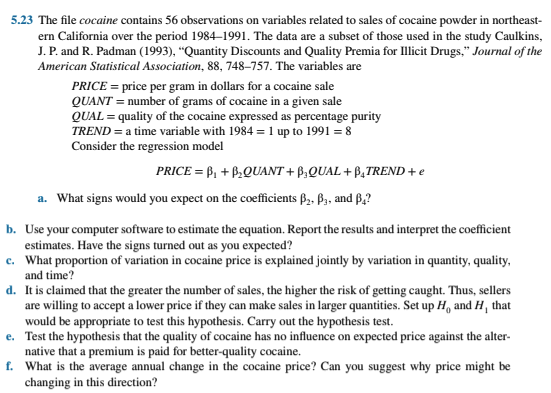

## C05Q23
### 題目


--

*BY 劉岳樺 Howard Liu (512717026)*

### (a) Q: What signs would you expect on the coefficients β₂, β₃, and β₄？

Ans: Expected Signs of the Coefficients
* β₂ (QUANT): Expected to be negative(-). 
  * Larger transaction volumes are typically associated with lower per-unit prices due to quantity discounts.
* β₃ (QUAL): Expected to be positive(+). 
  * Higher purity is assumed to charge a higher price, reflecting a quality premium.
* β₄ (TREND): Expected to be positive(+).
  * Because of inflation, prices tend to increase over time..

---

### (b) Q: Use your computer software to estimate the equation. Report the results and interpret the coefficient estimates. Have the signs turned out as you expected？

Ans:
```r
# R Code for building linear model
# import library
library(POE5Rdata)

# dataset
data(cocaine)

# calc linear regression
model <- lm(price ~ quant + qual + trend, data = cocaine)
summary(model)
```
### The Summary Result：

|              |   Estimate   |  Std. Error  |   t value   |      Pr [>abs(t)]  |
|--------------|--------------|--------------|-------------|--------------------|
| (Intercept)  | 90.84668753  | 8.58025368   | 10.5878790  | 1.393119e-14       |
| quant        | -0.05996979  | 0.01017828   | -5.8919359  | 2.850720e-07       |
| qual         | 0.11620520   | 0.20326448   | 0.5716946   | 5.699920e-01       |
| trend        | -2.35457895  | 1.38612032   | -1.6986829  | 9.535543e-02       |

### The estimated equation should be： 
$$
\widehat{PRICE} = 90.847 - 0.060 \cdot QUANT + 0.116 \cdot QUAL - 2.355 \cdot TREND
$$

### The Coefficient Result：

| Variable | Estimate | t-value | p-value   | Conclusion                         |
|----------|----------|---------|-----------|------------------------------------|
| quant    | -0.06    | -5.89   | 2.85E-07  | ✅ Highly significant, has impact.   |
| qual     | +0.12    | 0.572   | 0.57      | ❌ Not significant, effect uncertain. |
| trend    | -2.35    | -1.699  | 0.095     | ⭕ Marginally significant, possible effect. |


> 💡 **Observation**  
> The result for **Trend** is somewhat different from what I originally expected, and the significance of **Qual** is **less than expected**.

---

*BY 江文煌 Wen=Hwang, Jiang (512717024)*
### (c) Q: What proportion of variation in cocaine price is explained jointly by variation in quantity, quality, and time?

Ans:
### Model R² = 0.5097 ~51%

This means about 51% of the variation in price is explained by the model (QUANT, QUAL, and TREND).

*[51%] This suggests moderate explanatory power

**(R code)**


---

### (d) Q: It is claimed that the greater the number of sales, the higher the risk of getting caught. Thus, sellers are willing to accept a lower price if they can make sales in larger quantities. Set up H₀ and H₁ that would be appropriate to test this hypothesis. Carry out the hypothesis test.

Ans:

**Set up the hypotheses:**
- H₀: β₂ ≥ 0 (no effect of quantity on price)
- H₁: β₂ < 0 (quantity has a negative effect on price)
Result：
t value = -5.892 , one-tailed p value = 1.425e-07 

*For this hypothesis, The calculated t-value is -5.892. We reject H0.(less than or equal to the critical 
(t-=1.675, 0.95,n-4). To conclude that sellers are willing to accept a lower price if they can make sales in larger quantities.


**(R code)**


---

*BY 劉岳樺 Howard, Liu (512717026)*

### (e) Q: Test the hypothesis that the quality of cocaine has no influence on expected price against the alternative that a premium is paid for better-quality cocaine.

Ans:

### 🔹 Step 1: Hypotheses

```
H₀: β₃ = 0   (Quality has no effect on Price)  
H₁: β₃ > 0   (Better quality leads to higher Price)
```

### 🔹 Step 2: Sample Statistics (Already known in summary)

```
Estimated coefficient (β₃) = 0.11621  
Standard Error (SE) = 0.20326  
Degrees of Freedom (df) = 52
```

### 🔹 Step 3: Test Statistic

$$
t = \frac{0.11621 - 0}{0.20326} \approx 0.572
$$

### 🔹 Step 4: p-value

- Two-tailed p-value from `summary()` output: **0.57**
- Since we are conducting a **right-tailed test**, we divide it by 2:

$$
p_{\text{right-tail}} = \frac{0.57}{2} = 0.285
$$

> 📌 **Conclusion**  
> Since the one-tailed p-value is **0.285**, which is **greater than the significance level \(alpha = 0.05\)**,  
> we **fail to reject the null hypothesis**.  
> There is **not enough statistical evidence** to conclude that better quality leads to a higher price.

.png)
### R code for plotting
```r
# (e)
# 參數設定
t_val <- 0.572         # t 值
df <- 52               # 自由度
alpha <- 0.05          # 顯著水準

# t 分布範圍
x <- seq(-4, 4, length = 1000)
y <- dt(x, df)

# 繪圖
plot(x, y, type = "l", lwd = 2, col = "black",
     main = "Right-tailed t-test for β3 (Quality)",
     xlab = "t value", ylab = "Density")

# 陰影區域：右尾 p-value
x_shade <- seq(t_val, 4, length = 500)
y_shade <- dt(x_shade, df)
polygon(c(t_val, x_shade, 4), c(0, y_shade, 0), col = "red", border = NA)

# 顯示 t 值
abline(v = t_val, col = "red", lty = 2)
text(t_val + 0.1, 0.1, paste("t =", round(t_val, 3)), col = "black")

# 註解
legend("topright", legend = c("t-distribution", "p-value area", "t observed"),
       col = c("black", "red", "red"), lty = c(1, NA, 2), lwd = c(2, NA, 1), pch = c(NA, 15, NA),
       pt.cex = 1.5, bty = "n")
```
---

### (f) Q: What is the average annual change in the cocaine price? Can you suggest why price might be changing in this direction?

Ans:

The average annual change in price refers to the coefficient of **Trend**,  
which is:

$$
\beta_4 = -2.35458
$$

This means that, on average, the price of cocaine **decreased by \$2.35 per year** over the observed period.

### 🔍 Possible Explanations for This Decline:

- Expansion of drug trafficking organizations may have **lowered raw material and production costs**.
- The emergence of **alternative types of drugs** may have led to an **oversupply of traditional cocaine** in the market, pushing prices down.  
---

